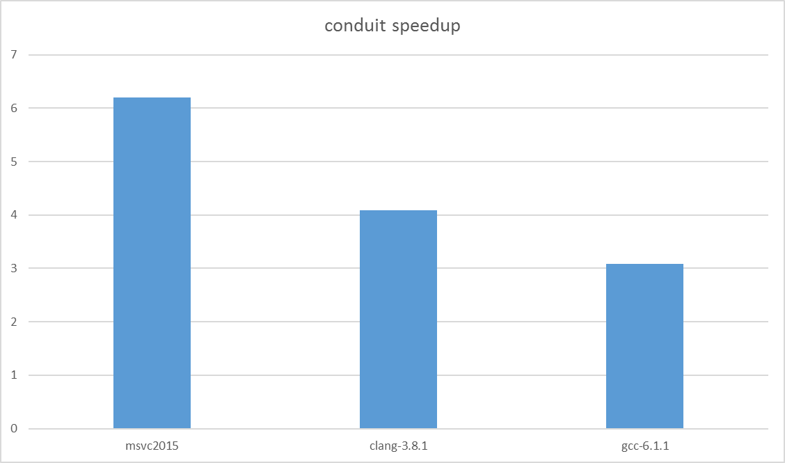

conduit is a type-safe, c++14 publish/subscribe library. It connects multiple message producers to multiple message consumers.

.. contents:: Table of Contents

Introduction
------------

The conduit library provides a mechanism to connect producers and consumers using familiar function call syntax and semantics. Because these connections are performed at runtime, and each connection allows multiple producers and multiple consumers, the library opens-up many use cases beyond normal static linkage.

This functionality is sometimes called signals and slots, or publish/subscribe. There are other c++ libraries which provide similar functionality, but none that met Roanoke's needs. For example, a simple speed comparison of conduit versus Boost.Signals2 shows conduit to be from 3 to 6 times faster.

Speed wasn't the only factor in the decision to build our own library; `Conduit Features`_ provides additional information about the features in Roanoke's publish/subscribe library.

The source for these tests can be found `here (conduit)`__ and `here (signals)`__. Each was compiled at `O3` on Linux and `O2` on Windows. For example::

    g++-6 -std=c++14 -O3 -o conduit-test conduit-test.cpp -I .../conduit/include -D CONDUIT_NO_LUA

And, while this example doesn't make use of the conduit/Lua integration for simplicity, there is no speed cost with including the Lua bridge.

Basics
------

conduit provides a connection abstraction similar to a telephone switchboard or breadboard. The connection is called a channel, and represents something like the terminal strip on a breadboard. A channel requires a producer and a consumer connected to the strip before it becomes useful. Producers use a channel to send messages to all consumers of that channel. And, like a breadboard strip, multiple producers can connect to multiple consumers. Unlike a breadboard strip, messages from producers never interfere with each other, each message sent by a producer is delivered to consumers.

conduit uses function call syntax to communicate using channels. Producers pass data to consumers by calling the channel. Consumers listen on a channel by registering a callback (a function), termed hooking a channel, that will be called for each message sent on the channel.

The producer code:

.. code:: c++

    // First get access to the channel
    auto channel = reg.publish<void(std::string)>("hello world channel");
    // Now send a message on the channel
    channel("hello, world!");

The consumer code:

.. code:: c++

    reg.subscribe<void(std::string)>("hello world channel", [] (std::string s) {
        std::cout << s << std::endl;
    }));

Channels are fast, just slightly slower (~25%) compared to virtual functions, but provide many benefits (N-to-M messaging, identifiable communication, decoupled communication, automatic debugging, etc.). Use channels liberally.

Conduit Features
----------------

- Managed publish/subscribe library written in c++14.
- Automatic per-channel event logging.
- Runtime connection steering.
- Optional, tight integration with the Lua scripting language allowing Lua to be both channel producer and consumer.
- Easy integration with cycle accurate frameworks.

TODO - expand on each feature.

Examples
--------

A basic example of using conduit can be found in examples/conduit-example.cpp

