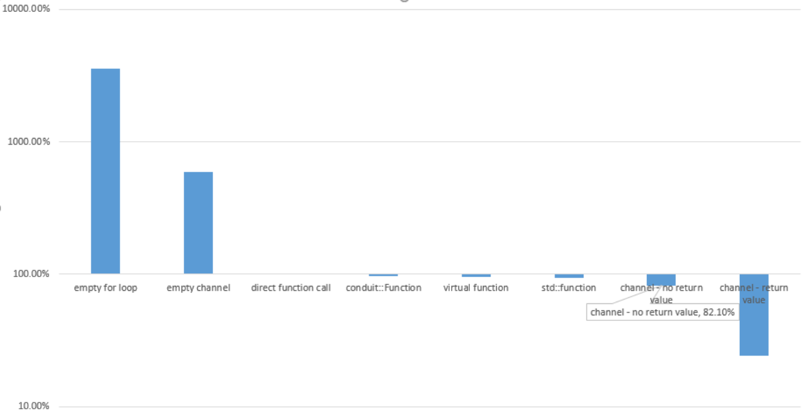
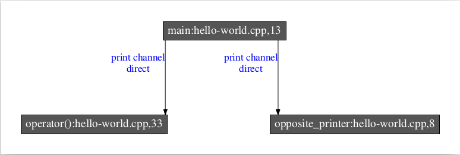

=======
Conduit
=======

|
|

.. class:: center

https://github.com/voxmea/conduit

.. contents::

What is it?
-----------

- High performance publish/subscribe library
    - Connects *m* producers to *n* consumers at runtime
    - Connections are type safe and identified by function signature and string
    - Excellent software abstraction for both model communication and events 

|

.. code-block:: c++

    //          signature           name
    //              ↓                 ↓
    reg.hook<void(std::string)>("print channel",
    [] (const std::string &s) {
        printf("%s", s.c_str());
    });
    //                         signature           name
    //                             ↓                 ↓
    auto print = reg.lookup<void(std::string)>("print channel");
    print("hello, world!\n");

..
    publish/subscribe is a software methodology to connect producers and consumers without the 2 knowing anything about each other. Fantastic way to decouple software components.

Defining the problem
--------------------

- Typical modeling libraries are defined in terms of structure

    - Timing boundaries
    - Connections/ports
    - Units

- Conduit defines the model in terms of communication

    - Data flow
    - Component interaction

Communication is a useful problem domain
----------------------------------------

- Mirrors the RTL implementation

    - Data and control flow are the primary problems
    - Timing is secondary

- **Focus on state and the modification of state** (*state is the enemy!*)
- Focusing on communication with conduit improves predictive confidence while maintaining flexibility

    - Conduit communication medium allows subdivision of components at natural boundaries
    - Allows timing to be added and changed as appropriate, without changing interfaces

.. 
    .. image:: unit-test.png
        :height: 200px
        :align: center

Goals
-----

- Performance and power prediction
- Architectural and microarchitectural insight
- RTL correlation

What's wrong with traditional approaches?
-----------------------------------------

- Inheritance is the base class of evil
- Rigid communication/interfaces couples components
- State transitions are implicit
- Encourages monolithic implementations
- Limited opportunity for re-use (functional interface != modeling interface)
- Difficult to generate continuous results

.. 
    Talking software philosophy with practical consequences. Ideally we want easy composition of flexible components that can be used in multiple contexts, oh and accross timing boundaries. Easier said than done.

    Can still make practical advances (particularly around handling of state)

How does conduit fix things?
----------------------------

- Uses natural function call syntax
- No structural or layout requirements placed on code
- Encourages explicit state transitions based on events 
- Easy composition
- Evolutionary design, continuous results
- Flexible interfaces allows multiple simultaneous implementations
- Concurrency (not parallelism) is an explicit aspect of the modeling infrastructure

.. Partial interfaces are well supported.

Modeler contract (1)
--------------------

- Conduit call-tree reflects problem decomposition

    - Generated from conduit static analysis tool
    - Self-documenting and easy to review
    - Data flow + timing information

Modeler contract (2)
--------------------

- Model correctness is measured, not correct by design

    - Timing and policy verification
    - Measurement code is external to model code and uses the same conduit interfaces
    - Run on the relevant workloads (direct measurement, not proxy)

Conduit and the modeler contract 
--------------------------------

- Nothing here that can't be done with other frameworks, with enough time and effort
- Conduit makes this natural

Overhead
--------

Call speed relative to non-inlined direct call (c-style call)



..
    Note that it's probably doing some devirtualization (but is not inlining actual call)

Conduit integration
-------------------

- Conduit places no requirements on structure or layout of model code
- Can integrate into existing modeling infrastructure
- Event scheduling is orthogonal (but examples are provided)
- Gradual integration is easy

    - Use existing infrastructure at large boundaries, use conduit everywhere else

Building blocks
---------------

- Channel is the communication medium
- Channels are found in a registrar (registrar handles lifetime, no ordering issues for clients, registrar must exist as long as its channels)
- Every registrar is named (registrar is a namespace, example to follow)
- `lookup` a channel to send messages
- `hook` a channel to receive messages

Example
-------

.. code-block:: c++

    void opposite_printer(const std::string &s) {
        fmt::print("{}", s == "hello" ? "world" : "hello");
    }

    int main(int argc, char const *argv[]) {
        conduit::Registrar reg("reg", L);
        auto print = reg.lookup<void(std::string)>("print channel");
        reg.hook<void(std::string)>("print channel",
        [] (const std::string &s) {
            fmt::print("{}", s);
        });
        reg.hook< void(std::string) >("print channel", opposite_printer);

        print("hello");
    }

Example takeaways
-----------------

- Data flow is created by connecting components through channels
- Channels should be used throughout the model, not just on timing/interface boundaries
- Every channel is documentation of the data flow, as well as a probe point for debugging, timing verification, and performance analysis

Analyze
-------

clang-based static analysis tool generates call-graph through channels, includes timing information (none in this example)

|
|



Configuration
-------------

- Namespaces provided through registrars
- **Individual components should be contextually unaware** (they don't know what they connect to, nor the namespace they work in)
- Higher-level configuration performed by connecting channels from separate registrars

    - Connections performed by configuration code, not model code
    - Easy to instantiate many sub-units (e.g. multiple cores)
    - Simply create a new registrar (with a new name) and re-initialize components

Debugging features
------------------

- Each channel has built-in printing capabilities

    - Per-channel control over debug output (very useful for developers to isolate their area of the model)
    - Debug output doesn't litter model code, automatic at the interface

- Custom types supported by ADL (customization points)

Scripting integration
---------------------

- Lua and Python are well supported
- Flexible Lua/Python/c++ bridge makes language crossing trivial

|
|

Lua
```

.. code-block:: lua

    conduit.regisrars.reg.hook('print channel', function(s)
        printf('%s\n', s)
    end, 'lua')

Python
``````

.. code-block:: python

    reg.lookup('print channel').hook('print channel', lambda s: print(s))

.. |1/4| unicode:: U+00BC

Summary
-------

- A tweak to our view of the problem enables new tools to tackle a complicated software problem
- Conduit enables a wide variety of improvements without needing to rewrite model source
- The publish/subscribe framework enables more cross-team collaboration (both in model libraries, and with model tools)
